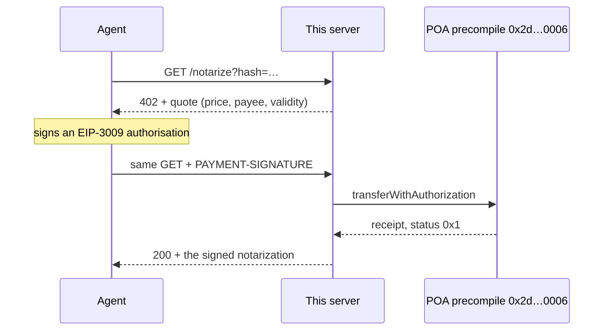

# A tollbooth for AI agents

A web service that charges **0.001 USDC per call**, settles the payment itself, and asks nobody for
an account. It is running right now:

[](https://poa-x402-seller.fly.dev/health)


[](https://ko-fi.com/pavelg)

```console
$ curl -si https://poa-x402-seller.fly.dev/notarize | head -1
HTTP/2 402
```

That is a price tag, served over plain HTTP, to anything that can read.

## Why this may matter

Software has one business model: sign up, get an API key, pay monthly. It assumes a human with an
email address, a card and patience. An agent has none of those, and it does not want a relationship
with your service — it wants one answer, once, and it is willing to pay for it.

HTTP has had a status code for this since 1997. **402 Payment Required** sat unused for nearly thirty
years because there was no way to pay a web request. [x402](https://x402.org) revives it: the server
answers `402` with a price, the client signs a payment and retries, the server serves. Payment
becomes the authentication. No account, no key, no invoice, no free tier to abuse, no churn.

Three things follow, and they are why a 230-line server is worth your attention.

**1. Pricing below a penny starts working.** This server charges a tenth of a cent per call and keeps
it. On a chain with gas fees the fee would exceed the price and per-use pricing would be a rounding
error; here transfers cost nothing and settle in about two seconds. A tool can cost 0.001 USDC per
use instead of $20 a month — the first honest price for something an agent calls six times and never
again.

**2. The seller needs nobody's permission.** This repo uses no payment facilitator: it submits the
buyer's signed payment to the ledger itself. The whole dependency list is one key and an RPC URL, and
a brand-new address holding nothing collected its first payment that way. We found this the hard way —
the ledger's own hosted facilitator settles only for its own demo merchant, so a third-party seller
cannot use it. Removing the middleman turned out to be easier than asking to be let in, and now
nobody can gate who is allowed to be paid.

**3. Both sides end up with a receipt they can check.** Every sale is a signed record naming the
payment, and the buyer's side signs its own. "Who authorised this payment, and was it within what
they authorised?" is exactly what regulators are now asking about AI agents. Here it has a mechanical
answer instead of a support ticket.

The honest part: these tolls are tenths of a cent on an experimental USDC ledger (POA chain 77), and
total revenue to date is **0.008 USDC**. Nobody is quitting their job. The pattern is the point, and
it transfers to any rail that can settle a signed payment authorisation.

## Try it without spending anything

```bash
curl -s https://poa-x402-seller.fly.dev/health
curl -s -X POST https://poa-x402-seller.fly.dev/mcp \
  -H 'content-type: application/json' \
  -d '{"jsonrpc":"2.0","id":1,"method":"tools/list"}'
```

The `402` carries the quote in a `PAYMENT-REQUIRED` header: price, payee, asset, and how long the
payment stays valid. Nothing hidden behind a signup.

## Pay it for real

`pay.mjs` is a single file whose only dependency is `viem`. It refuses any quote it cannot price
honestly, and never pays more than `--max`.

```bash
npm i viem
node pay.mjs --quote                 # what the seller asks — no key, no money
node pay.mjs --keygen                # a fresh key; get its address funded with a few cents
PAYER_PRIVATE_KEY=0x… node pay.mjs   # pays 0.001 USDC, prints the proof and the transaction
```

You need a few cents of USDC on POA chain 77. There is no public faucet, so ask whoever pointed you
here, or bridge in through the POA dApp.

## What you buy

One tool, deliberately dull, so the payment is the interesting part. **`notarize(hash)`** anchors a
32-byte hash to a POA block and signs the result:

```json
{
  "type": "poa.notarization", "chainId": 77,
  "notary": "0xdC6C7F3dcEC8Ac75d3656bfD697a693acEB38244",
  "hash": "0x91f5d118…", "poaBlock": 715282,
  "poaBlockHash": "0xd9622a61…", "ts": "2026-09-22T09:24:02.993Z",
  "digest": "0x…", "serverSig": "0x…"
}
```

Proof that the hash existed by that block, checkable by anyone:
`node verify-notarization.mjs proof.json` recomputes the digest, recovers the notary, and confirms the
block hash against the chain.

## How one payment flows



Two seconds, give or take. The server serves only once the money is final on-chain.

## Five things a naive implementation gets wrong

We got all five wrong first. They are why this is more than a demo.

1. **Trusting the client's echo of the quote.** A client sends back what it "agreed to pay". That is a
   claim, not evidence. The signature is checked against the quote *this server* issued.
2. **Letting one payment buy unlimited service.** x402 tells clients to retry the same payment header
   after a failure, so a server must remember paid authorisations — and pin each one to the exact
   request it paid for. Remember the payment alone and one toll buys every call you like.
3. **Charging without serving.** If the RPC dies between broadcasting the settlement and reading its
   receipt, a naive server has taken the money and lost the sale. Here the settlement transaction is
   signed, hashed and written down *before* it is broadcast. An unresolved payment answers
   `402 settlement_pending` with the transaction hash, and a retry resends that same signed
   transaction, which can land at most once.
4. **Believing the quote's units.** The buyer has the mirror of this bug: a seller that declares a
   different number of decimal places can slip a payment ten times larger under a spending cap.
   `pay.mjs` pins the asset, the signing domain and 6 decimals, and refuses anything else.
5. **Becoming an amplifier.** A public seller that hits the chain for every stranger is a free way to
   hammer someone's RPC. So: per-client rate limit, request size cap, and a liveness endpoint that
   touches no chain — a chain outage must not make the host restart the process mid-settlement.

## What is inside

| file | |
|---|---|
| `seller.mjs` | the server: quotes, binds, settles, then serves. HTTP and MCP |
| `seller-lib.mjs` | quoting, binding checks, settlement calldata, signed receipts |
| `pay.mjs` | one-file buyer, only needs `viem` |
| `test-seller.mjs` | 23 live checks — every way we could think of to walk past the paywall |
| `monitor.mjs` | what a customer sees: honest quote, right payee, right price, chain alive |
| `verify-notarization.mjs` | check a proof you bought, against the chain |
| `seller-keygen.mjs` | mint the seller's key; it only ever receives |
| `RUNBOOK.md` | deploy, roll back, read the receipts, rotate the key, incidents |

Node 22+, `viem`, nothing else. The MCP endpoint speaks Streamable HTTP, so an agent that can sign can
discover and pay for the tool with no credentials at all.

## Run your own

```bash
npm install
npm run keygen                                  # writes .env.seller (0600) + seller.address
node --env-file=.env.seller seller.mjs          # :8402
node --env-file=/path/to/payer.env test-seller.mjs http://localhost:8402
```

Deploying to Fly.io is five commands, about $0.15 a month for the disk and near zero compute while
idle — see [RUNBOOK.md](RUNBOOK.md). Run exactly one machine: the ledger that makes retries safe is a
file on its volume.

Main settings: `SELLER_PRICE_ATOMIC` (1000 = 0.001 USDC), `SELLER_MAX_TIMEOUT`,
`SELLER_RATE_PER_MIN`, `SELLER_PUBLIC_URL`. Full table in the runbook.

## Known limits

- **Settlement status is knowable only by transaction hash.** POA's public RPC offers no
  `eth_getLogs` and no `eth_call`, so the server cannot ask "was this authorisation consumed, and by
  whom?" If someone front-runs a buyer's authorisation — EIP-3009 payments are bearer instruments —
  our settlement reverts while the money still arrives, and the server cannot see that it was paid.
  Only possible if a payment header leaks.
- **A settled authorisation is public**, in the settlement transaction's calldata. Until it expires,
  anyone who also knows the exact request can fetch the cached result. Harmless for `notarize`; a tool
  that sells data should cache briefly or not at all.
- **Settlements run one at a time.** On this chain a failed transaction does not consume its nonce, so
  concurrent settlements can strand each other. Fine at this scale, not at a thousand calls a second.
- The buyer side — an agent wallet that pays under a signed spending mandate with per-call caps, a
  counterparty allowlist and a kill switch — lives in a private repo. Ask if you want a look.

## Buy me a coffee

If this saved you a weekend, or you just like that HTTP 402 finally does something:
**[ko-fi.com/pavelg](https://ko-fi.com/pavelg)**. Tips in USDC on POA work too, obviously —
`0xdC6C7F3dcEC8Ac75d3656bfD697a693acEB38244` — and you can verify your own tip arrived.

## Who built this

[Pavel Guzhikov](https://guzh.uk) — London-based founder, twenty years building, most of it hands-on:
co-founding team of Uzum (Uzbekistan's first unicorn: payments, cards, lending, marketplace), founded
Worki (acquired by Mail.Ru Group), co-founded an earned-wage-access fintech. Now working on agent
payments — the accountability layer rather than the rail.

Built with [Claude Code](https://claude.com/claude-code), which then paid for the tool it had just
helped ship: under a mandate, with a kill switch that stopped it mid-task. That part is the point.
